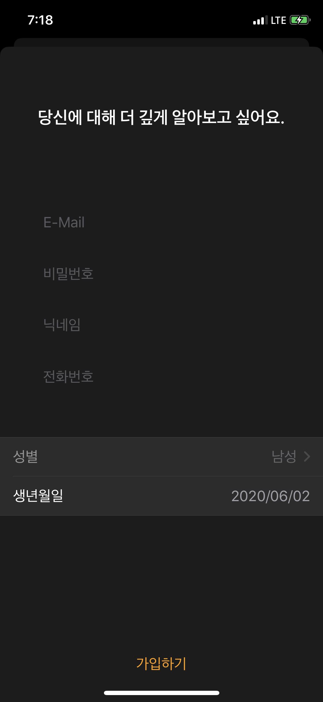

# Swift_Practice

**Expecting Features : Firebase Auth(with E-mail, Google, Facebook, Apple), Firestore Database, AR with Apple ARKit, Compatibility with Apple Pencil using PencilKit**

**_Compatibility with : iPad Pro 12.9(1st, 2nd, 3rd, 4th Generation), iPad Pro 11(1st, 2nd Generation), iPad(5th, 6th, 7th Generation), iPad Air(3rd Generation), iPhone 6s, iPhone 6s Plus, iPhone 7, iPhone 7 Plus, iPhone 8, iPhone 8 Plus, iPhone SE(2nd Generation), iPhone X, iPhone XS, iPhone XS Max, iPhone 11, iPhone 11 Pro, iPhone 11 Pro Max_**

**_OS Compatibility : iOS 13, iPad OS 13_**

- Change Log

2020-06-02

- Added Features : Sign-up Screen with SwiftUI

